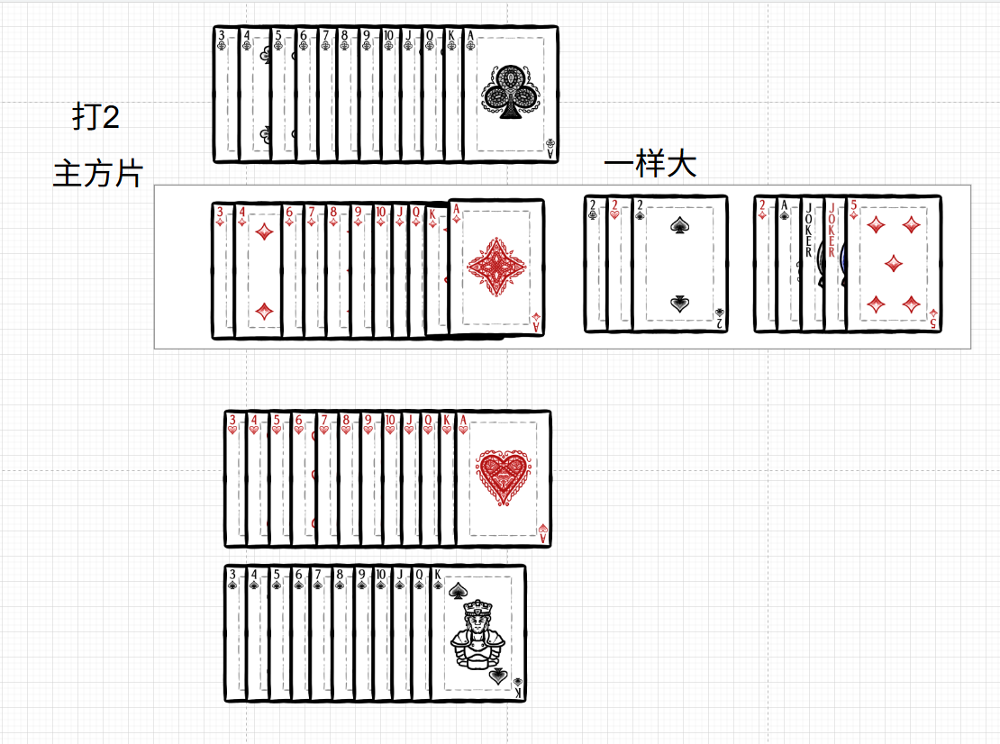
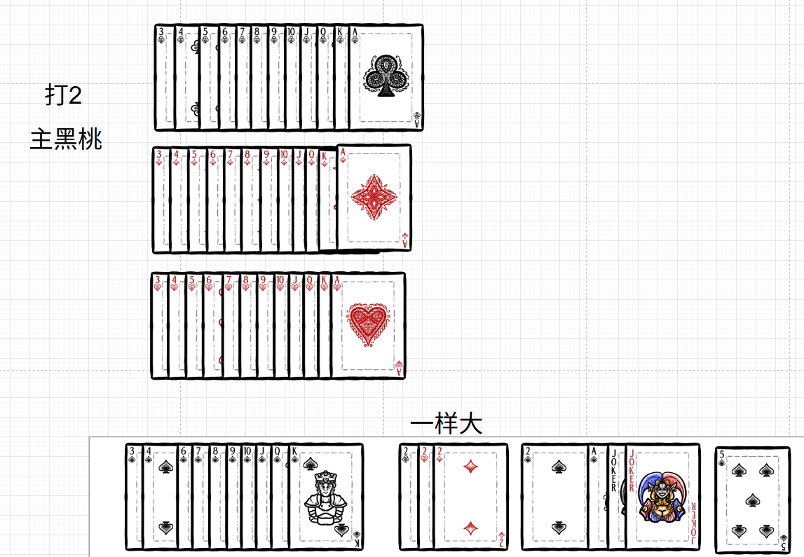
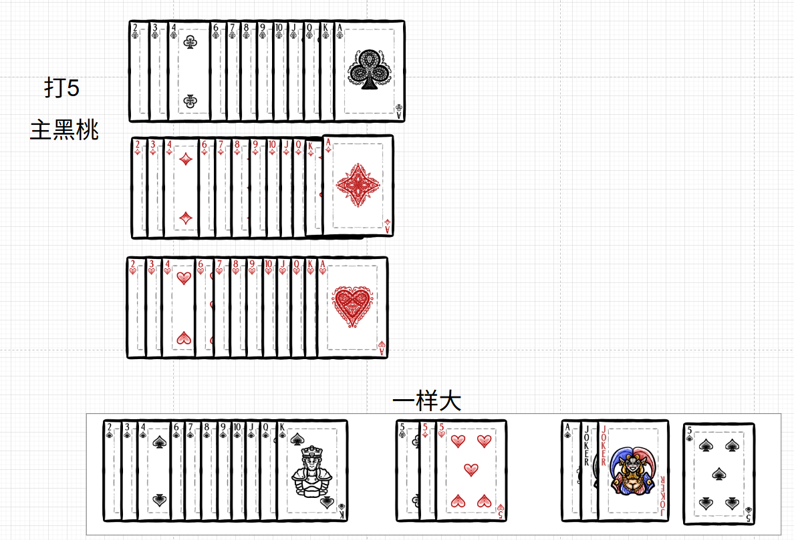

# 昆明双扣·快速上手规则（完善版）

## 一、基础信息
- **牌**：两副扑克（108 张），每人 25 张，底牌 8 张。
- **人**：4 人，对家一队（座位交叉）。
- **分**：5（5 分）、10（10 分）、K（10 分），总共 200 分。
- **目标**：守分或抢分，先打过 A 的一方获胜。

---

## 二、什么是主牌？
- **常主（固定主牌）**：大王、小王、黑桃 A，永远是主牌。
- **级牌（机动主牌）**：当前打几，四个花色的这几张牌就是级牌。  
  - 升级顺序：**2 → 5 → 10 → J → Q → K → A → 2**（循环）  
  - 必打级牌：**2、J、A** 不能跳过。
- **主牌花色**：亮主时确定的那个花色，该花色的所有牌也都是主牌。

**一句话**：主牌 = 常主 + 级牌（四花色） + 主牌花色的所有牌。

---

## 三、牌力大小顺序（最重要！）

### 1. 主牌大小顺序（以打 2、方块为主为例）

| 顺序          | 牌                         | 说明                         |
| ------------- | -------------------------- | ---------------------------- |
| **1（最大）** | **方块 5**                 | **中心 5**，整局最大         |
| 2             | 大王                       |                              |
| 3             | 小王                       |                              |
| 4             | 黑桃 A                     |                              |
| 5             | **方块 2**                 | 主牌花色的级牌               |
| 6             | **黑桃 2、红桃 2、梅花 2** | 其他花色的级牌，这三张一样大 |
| 7             | 方块 K                     |                              |
| 8             | 方块 Q                     |                              |
| 9             | 方块 J                     |                              |
| 10            | 方块 10                    |                              |
| 11            | 方块 9                     |                              |
| 12            | 方块 8                     |                              |
| 13            | 方块 7                     |                              |
| 14            | 方块 6                     |                              |
| 15            | 方块 4                     |                              |
| 16            | 方块 3                     | 最小                         |

**记住**：中心 5（亮主花色的 5） > 大王 > 小王 > 黑桃 A > 主级牌 > 其他级牌 > 主花色 A…K…3

### 2. 副牌大小顺序（所有非主牌花色）

**完整顺序**：**A > K > Q > J > 10 > 9 > 8 > 7 > 6 > 5 > 4 > 3 > 2**

> **说明**：副牌中不包含当前级牌（因为级牌已归入主牌），但 5、10、K 作为分牌正常存在。  
> 例：打 2 时，副牌中没有 2；打 5 时，副牌中没有 5，此时 5 全变为主牌但仍带 5 分。

---

## 四、亮主与庄家

- **亮主**：摸牌时亮出一张当前级牌，你成为庄家，该花色为主牌。
- **定主**：亮出一对级牌，直接定死花色，别人不能再反花色。
- **反主**：定主前，别人亮出另一对级牌，可以反主，新花色成为主牌。
- **无人亮主**：需要翻看底牌，由当前先摸牌的人，指定“遇大”或“遇小”（即翻开底牌决定主牌花色）。

---

## 五、出牌规则

1. **必须跟花色**：别人出什么花色，你也要出这个花色。
2. **没有该花色**：
   - **垫牌**：随便出，不参与竞争。
   - **毙牌**：出主牌，必须**牌型完全一样**（对方出单张，你也要出单张主牌；对方出对子，你也要出对子主牌）。
3. **牌不够**：没有对子/没有连对，有多少出多少，剩下的用其他牌垫。这种情况属于垫牌，不参与比较。

---

## 六、拖拉机（连对）

- **定义**：花色相同、点数相连的至少两对牌。
- **主牌拖拉机**：可以跨类别，只要在主牌顺序中相邻。  
  例（打 2 方块主）：方块 5+方块 5 + 大王+大王 构成拖拉机。
- **副牌拖拉机**：按副牌顺序（A-K-Q-…-2）相连即可，除去当前级牌。  
  例（打 10 方块主）：梅花 99+梅花 JJ 属于连对（因为 10 不在副牌中，9 和 J 相邻）。

---

## 七、甩牌

- **条件**：你确信手上的这几张牌，在当前花色中都是最大的，可以一次性全甩出去。
- **失败**：如果判断错误，甩出的牌中有不是最大的，必须打出其中最小的一张，其余收回，罚 5 分给对方。

---

## 八、计分与抠底

### 1. 得分
- 每轮谁牌最大，谁拿走这一轮的所有分牌（5/10/K）。
- 庄家方赢的分**作废**，闲家赢的分**累计**。

### 2. 抠底（最后一轮）
- 如果最后一轮**闲家牌最大**，就翻开底牌，底牌里的分**翻倍**后加给闲家。
- **翻倍规则**：最后一轮闲家出几张牌，底牌分就翻几倍（1 张不翻倍，2 张×2，4 张×4，依此类推）。

---

## 九、升级与胜负

### 升级得分表

| 闲家得分         | 结果                               |
| ---------------- | ---------------------------------- |
| **0 分**         | 庄家方升 **3 级**（大光）          |
| **1 ~ 39 分**    | 庄家方升 **2 级**（小光）          |
| **40 ~ 79 分**   | 庄家方升 **1 级**                  |
| **80 分**        | **强庄**（庄家继续坐庄，级牌不变） |
| **81 ~ 119 分**  | 闲家**上台**（庄家下台），级牌不变 |
| **120 ~ 159 分** | 闲家上台，且闲家**升 2 级**        |
| **160 ~ 200 分** | 闲家上台，且闲家**升 3 级**        |

### 轮庄
- 庄家升级或强庄 → 下一局由**对家**坐庄。
- 闲家上台 → 下一局由**下家**坐庄。

---

## 十、J 和 A 的特殊降级（过沟、戴帽）

### 打 J 时
- 如果闲家得分 **大于 80 分**，且最后一轮用 **J 抠底**，则庄家方直接 **降级到 2** 并下庄。
- 如果闲家得分 **小于 80 分**，且最后一轮用 **J 抠底**，则庄家方按照正常得分升级（即根据闲家得分按升级表处理）。
- 其他情况（未用 J 抠底或得分等于 80 分），按正常升级规则进行。

### 打 A 时
- 如果闲家得分 **大于 80 分**，且最后一轮用 **A 抠底**，则庄家方直接 **降级到 J** 并下庄。
- 如果闲家得分 **小于 80 分**，且最后一轮用 **A 抠底**，则庄家方 **直接赢得比赛**（打过 A）。
- 其他情况（未用 A 抠底或得分等于 80 分），按正常升级规则进行。

---

## 附录：牌级参考
被框起来的是主牌

---

---

